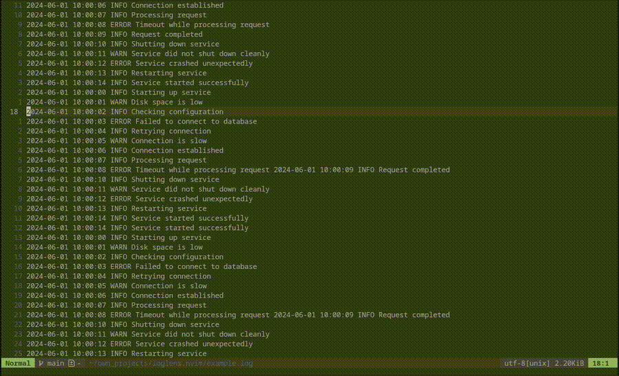

# LogLens.nvim

A Neovim plugin for interactive log file analysis. Highlight, filter, and jump
between log entries using customizable patterns and a split window interface.

---

## Quick Start

1. Install with lazy.nvim (see below).
2. Open a log file.
3. Run `:LogLensOpen` to analyze logs.

---

## Requirements

- Neovim tested on v0.11.5, older versions may work but are not guaranteed.
- Lua support enabled

---

## Installation

**With [lazy.nvim](https://github.com/folke/lazy.nvim):**

```lua
{
    'RubikNube/loglens.nvim',
    event = 'BufRead',
    config = function()
        require('loglens').setup {
            patterns = {
                { regex = 'ERROR', fg = '#ffffff', bg = '#ff0000' },
                { regex = 'WARN', fg = '#000000', bg = '#ffff00' },
                { regex = 'INFO', fg = '#ffffff', bg = '#0000ff' },
                { regex = 'DEBUG', fg = '#000000', bg = '#00ffff' },
                { regex = 'timeout', fg = '#ffffff', bg = '#ff8800' },
                { regex = '^%s*//.*', fg = '#00ff00', bg = '#ffffff' }, -- Commented out lines
            },
        }
        -- Keybindings for LogLens commands
        vim.keymap.set('n', '<leader>lo', ':LogLensOpen<CR>', { desc = 'LogLens: Open analysis window' })
        vim.keymap.set('n', '<leader>lc', ':LogLensClose<CR>', { desc = 'LogLens: Close window' })
        vim.keymap.set('n', '<leader>lC', ':LogLensConfigure<Space>', { desc = 'LogLens: Configure pattern' })
        vim.keymap.set('n', '<leader>le', ':LogLensConfigureOpen<CR>', { desc = 'LogLens: Edit patterns (JSON)' })
        vim.keymap.set('n', '<leader>lE', ':LogLensConfigureClose<CR>', { desc = 'LogLens: Close pattern editor' })
        vim.keymap.set('n', '<leader>ll', ':LogLensLoad<CR>', { desc = 'LogLens: Load pattern config' })
        vim.keymap.set('n', '<leader>ls', ':LogLensSave<CR>', { desc = 'LogLens: Save pattern config' })
        vim.keymap.set('n', '<leader>lx', ':LogLensClear<CR>', { desc = 'LogLens: Clear all patterns/results' })
        vim.keymap.set('v', '<leader>la', ':LogLensAddPatternFromSelection<CR>', { desc = 'LogLens: Add pattern from visual selection' })
    end,
}
```

---

## Usage

Open a log file, then run:

```sh
:LogLensOpen
```

This opens a vertical split with all lines matching your patterns.
Press `<CR>` (Enter) on a line in the loglens split to jump to the corresponding
line in the original buffer (the original buffer will be focused in another split,
but your cursor remains in the loglens view.

---

### Adding Patterns from Visual Selection

You can quickly add a new pattern based on visually selected text:

1. Enter visual mode (`v` or `V`) and select the text you want to use as a pattern.
2. Run `:LogLensAddPatternFromSelection` (either via `:` or a keymap).
3. The selected text will be added as a new pattern, using a cycling color from the predefined color map.
4. The loglens view will automatically update to reflect the new pattern.

This is useful for interactively highlighting log entries or phrases directly from your log file.

## Commands

| Command                           | Description                                                                                                   |
| --------------------------------- | ------------------------------------------------------------------------------------------------------------- |
| `:LogLensOpen`                    | Analyze the current buffer and show matches in a vertical split. Press `<CR>` to jump to the original buffer. |
| `:LogLensClose`                   | Close the loglens window.                                                                                     |
| `:LogLensConfigure`               | Define or update log patterns on the fly. Usage: `:LogLensConfigure /REGEX/ fg=#RRGGBB bg=#RRGGBB`            |
| `:LogLensConfigureOpen`           | Open the current pattern configuration in a separate window (JSON format) for editing.                        |
| `:LogLensConfigureClose`          | Close the pattern configuration window if open.                                                               |
| `:LogLensLoad {file}`             | Load a pattern configuration from a JSON file.                                                                |
| `:LogLensSave {file}`             | Save the current pattern configuration to a JSON file.                                                        |
| `:LogLensAddPatternFromSelection` | Add a new pattern using visually selected text. Automatically updates the loglens view.                       |

---

## Pattern Configuration Example

```lua
require("loglens").setup({
  patterns = {
    { regex = "ERROR",   fg = "#ffffff", bg = "#ff0000" },
    { regex = "WARN",    fg = "#000000", bg = "#ffff00" },
    { regex = "timeout", fg = "#ffffff", bg = "#ff8800" },
  }
})
```

---

## On-the-fly Pattern Example

```sh
:LogLensConfigure /ERROR/ fg=#ffffff bg=#ff0000
```

---

## Editing Patterns in JSON

Use `:LogLensConfigureOpen` to open and edit your patterns in JSON format, for example:

```json
[
    { "regex": "ERROR", "fg": "#ffffff", "bg": "#ff0000" },
    { "regex": "WARN", "fg": "#000000", "bg": "#ffff00" }
]
```

---

## Example



---

## Troubleshooting

- **No matches found:** Check your pattern regex and color format.
- **Jumping doesn't work:** Ensure you are pressing `<CR>` in the loglens split, and that your Neovim version supports Lua plugins.

---

## Contributing

Pull requests and issues are welcome! Please open an issue for bugs or feature requests.

### Commitizen

This project uses [Commitizen](https://github.com/commitizen/cz-cli) for standardized commit messages and version management.

- To write a commit message:  
  `npx cz`
- To bump version and generate changelog (optional, with standard-version):  
  `npx standard-version`

**Example Commitizen message:**

```
feat(core): add pattern highlighting

Add support for highlighting log patterns using user-defined colors.
```

## Changelog

See [CHANGELOG.md](./CHANGELOG.md) for release history.

---

## Development

- Formatting: [stylua](https://github.com/JohnnyMorganz/StyLua)
- Linting: [luacheck](https://github.com/mpeterv/luacheck)
- Markdown linting: [markdownlint](https://github.com/DavidAnson/markdownlint)
- JSON formatting: [prettier](https://prettier.io/)

### Formatting & Linting Usage

- Format Lua: `npm run format:lua`
- Lint Lua: `npm run lint:lua`
- Format Markdown/JSON: `npm run format:md`
- Lint Markdown: `npm run lint:md`

**Install tools:**

- Lua tools:
  `stylua` and `luacheck` with a package manager of your choice
- Node tools:
  `npm install`

---

## License

MIT
